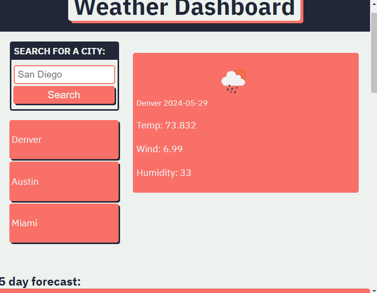
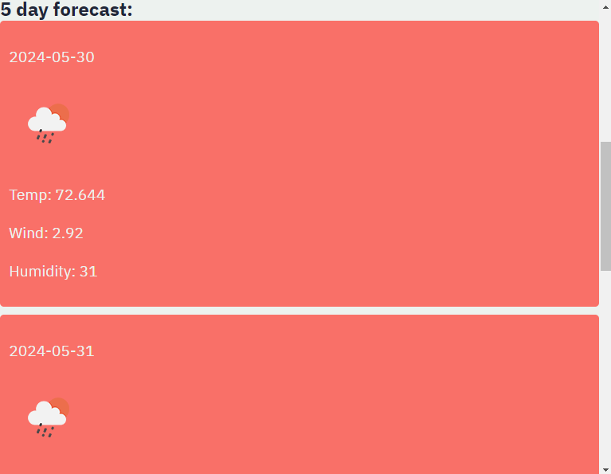

   # Weather Dashboard
   

   ## Description
    
   This app allows you to check the weather forecast for today and also for the next 5 days. It also saves your recently searched cities for easy acess for later.
   
   ## Usage
   
   Type in a city in the search bar. As you search for cities your history will generate buttons for each city you have searched and you can click on a button to view the weather for that city again.

   
   
   
   ## License
   
   MIT

   ## Questions

   For any additional questions, please contact me:
   github.com/GwiyomiAmy
   
   